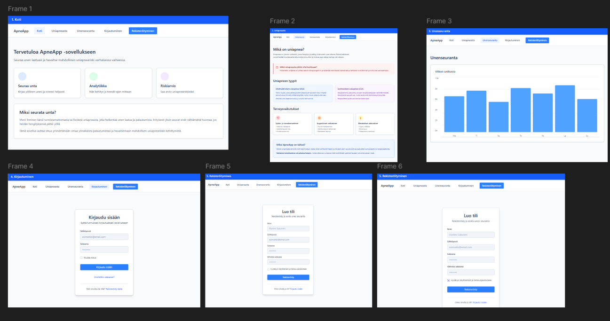

# ApneApp — Uniapnean seulontasovellus

Ryhmätyö Projekti: Terveyssovelluksen kehitys TX00EY13-3003 — Ryhmä 5

ApneApp on web-sovellus, joka tunnistaa uniapnean riskin yön yli -HRV-mittausten perusteella. Käyttäjä mittaa RRI-dataa Polar H10 -sykevyöllä Kubios HRV -sovelluksella ja synkronoi tulokset ApneAppiin, joka analysoi LF/HF-suhteen Kubios Cloud Analytics API:n avulla.

---

## Linkit

- Julkaistu sovellus (frontend): https://ryhma5-server.swedencentral.cloudapp.azure.com/
- Backend API: https://ryhma5-server.swedencentral.cloudapp.azure.com/api
- API-dokumentaatio: https://ryhma5-server.swedencentral.cloudapp.azure.com/docs
- Frontend-repo: https://github.com/MasalGit/Apneapp_FE/tree/ali-fe2-work/Apneapp
- Backend-repo: https://github.com/MasalGit/Apneapp_BE/tree/Henri_BE

---

## Testikäyttäjä

| Kenttä | Arvo |
|--------|------|
| Käyttäjätunnus (Kubios) | elsikubios@gmail.com |
| Salasana | hYr062vQh6 |

---

## Kuvakaappaukset


---

## Rautalankamallit



---

## Ominaisuudet

- **Kubios-kirjautuminen** — kirjautuminen Kubios-tunnuksilla, JWT-pohjainen autentikaatio
- **Mittausten synkronointi** — RRI-data haetaan Kubios Cloudista, analysoidaan Analytics API:lla ja tallennetaan tietokantaan (vain ≥ 3 h mittaukset)
- **Apneariskianalyysi** — aikamuuttuva LF/HF-analyysi (5 min ikkunat, 60 s siirto), riskitasot: normal / elevated / high
- **Dashboard** — unen keston ja LF/HF-suhteen visualisointi päivittäin valitulta ajanjaksolta
- **Uniapnearaportti** — keskimääräinen unen kesto, LF/HF-keskiarvo ja kohonneen riskin osuus
- **Yksittäinen mittaus** — aikasarjadata (LF/HF, SNS-indeksi, PNS-indeksi, stress-indeksi, syke)
- **Tietoturva** — käyttäjä näkee ja muokkaa vain omia tietojaan

---

## Tietokannan rakenne

```
Users
├── user_id (PK)
├── username
├── email
├── password
└── created_at
      │
      │ 1:N
      ▼
Measurements
├── measure_id (PK)  ← Kubios measure_id
├── user_id (FK → Users)
├── measured_at
├── duration_s       ← kesto sekunteina
├── lfhf_avg         ← LF/HF-suhteen keskiarvo
├── risk             ← normal / elevated / high
├── timeseries (JSON)
└── created_at
```

```sql
CREATE TABLE Users (
  user_id    INT AUTO_INCREMENT PRIMARY KEY,
  username   VARCHAR(50) NOT NULL UNIQUE,
  email      VARCHAR(100) NOT NULL UNIQUE,
  password   VARCHAR(255) NOT NULL,
  created_at TIMESTAMP DEFAULT CURRENT_TIMESTAMP
);

CREATE TABLE Measurements (
  measure_id  VARCHAR(100) PRIMARY KEY,
  user_id     INT NOT NULL,
  measured_at DATETIME NOT NULL,
  duration_s  FLOAT,
  lfhf_avg    FLOAT,
  risk        VARCHAR(20),
  timeseries  JSON,
  created_at  TIMESTAMP DEFAULT CURRENT_TIMESTAMP,
  FOREIGN KEY (user_id) REFERENCES Users(user_id),
  INDEX idx_user_measured (user_id, measured_at)
);
```

---

## API-endpointit

Kaikki suojatut reitit vaativat otsikossa: `Authorization: Bearer <token>`

### Kubios (`/api/kubios`)

| Metodi | Reitti | Kuvaus |
|--------|--------|--------|
| POST | `/kubios/login` | Kirjautuminen Kubios-tunnuksilla |
| GET | `/kubios/me` | Kirjautuneen käyttäjän tiedot |
| GET | `/kubios/userinfo` | Käyttäjätiedot Kubiosista |
| GET | `/kubios/history` | Tallennetut mittaukset listana |
| GET | `/kubios/history/:id` | Yksittäinen mittaus aikasarjoineen |
| GET | `/kubios/measures` | Mittauslista suoraan Kubios Cloudista |
| GET | `/kubios/sync` | Synkronoi uudet mittaukset Kubiosista |

### Mittaukset (`/api/measurements`)

| Metodi | Reitti | Kuvaus |
|--------|--------|--------|
| GET | `/measurements` | Mittaukset päivittäin ryhmiteltynä (`?days=7`) |
| GET | `/measurements/report` | Uniapnearaportti (`?days=7`) |

### Käyttäjät (`/api/users`)

| Metodi | Reitti | Kuvaus |
|--------|--------|--------|
| GET | `/users/:id` | Hae käyttäjä |
| PUT | `/users/:id` | Päivitä käyttäjän tiedot |
| DELETE | `/users/:id` | Poista käyttäjä |

---

## Tekninen arkkitehtuuri

### Backend

| Kerros | Tiedostot |
|--------|-----------|
| Routes | `kubios-router.js`, `measurements.js`, `user-router.js` |
| Controllers | `kubios-auth-controller.js`, `kubios-controller.js`, `user-controller.js` |
| Models | `measurement-model.js`, `user-model.js` |
| Services | `kubiosAnalytics.js` (Analytics API + riskialgoritmi) |
| Middlewares | `authentication.js` (JWT), `logger.js`, `error-handlers.js` |
| Utils | `database.js` (mysql2-pool) |

**Teknologiat:** Node.js (ESM), Express.js 5, MariaDB/MySQL, bcryptjs, jsonwebtoken, node-fetch, uuid

### Frontend

Vite-pohjainen SPA. Tuotantobuild palvellaan Expressin static-middlewarella (`public/`).

**Teknologiat:** Vite, Vanilla JS (ESM), Chart.js

### Infrastruktuuri

- Azure VM (Sweden Central) — Ubuntu, PM2, Nginx reverse proxy
- MariaDB paikallisesti VM:llä

---

## Asennus (kehitys)

```bash
npm install
cp .env.example .env
# Täytä .env: DB_*, JWT_SECRET, KUBIOS_*
npm run dev
```

### Tietokanta

```bash
mysql -u käyttäjä -p tietokanta < db/apneapp-db.sql
```

### API-dokumentaation generointi

```bash
npm run apidoc
# Dokumentaatio avautuu /docs
```

---

## Tunnetut bugit ja ongelmat

- Synkronointi voi kestää pitkään jos analysoitavia mittauksia on useita (Kubios Analytics API on hidas)
- Sovellus tukee vain Kubios-kirjautumista, omaa rekisteröitymistä ei ole
- Riskialgoritmin kynnysarvot perustuvat kirjallisuuteen, eivät kliiniseen validointiin

---

## Testit

Testitiedosto: [test/test-requests.http](test/test-requests.http) (REST Client, VS Code)

*(Testiraportti lisätään ennen palautusta)*

---

## Referenssit ja käytetyt lähteet

- [Express.js dokumentaatio](https://expressjs.com/)
- [Kubios Cloud API -dokumentaatio](https://www.kubios.com/kubios-cloud/)
- [jsonwebtoken](https://github.com/auth0/node-jsonwebtoken)
- [node-fetch](https://github.com/node-fetch/node-fetch)
- [Chart.js](https://www.chartjs.org/)
- [apidoc](https://apidocjs.com/)
- Hakala J. et al. (2014): *Kubios HRV — Heart rate variability analysis software*. Computer Methods and Programs in Biomedicine. DOI: 10.1016/j.cmpb.2014.07.024
- Penzel T. et al. (2003): *Comparison of detrended fluctuation analysis and spectral analysis for heart rate variability measurements in obstructive sleep apnea*. IEEE Trans. Biomed. Eng., 50(6):1143–51.

### AI:n hyödyntäminen

Projektissa on hyödynnetty Claude (Anthropic) -tekoälyä seuraavissa kohdissa:

- Kubios Analytics API -integraation toteutus (client_credentials OAuth2-virta)
- Aikamuuttuvan LF/HF-analyysin riskialgoritmin suunnittelu ja toteutus
- NaN-arvojen käsittely Analytics API -vastauksessa
- Azure-käyttöönoton vaiheet (PM2, Nginx, MariaDB)
- README.md:n kirjoittaminen

Opiskelija on tarkistanut, ymmärtää ja osaa selittää kaiken koodissa olevan logiikan.
